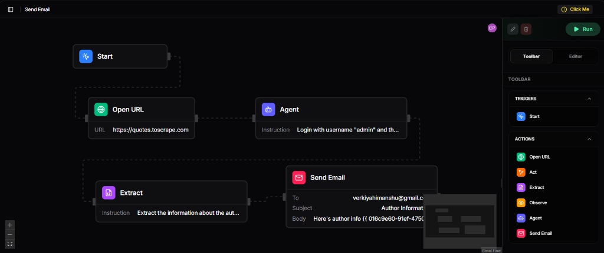
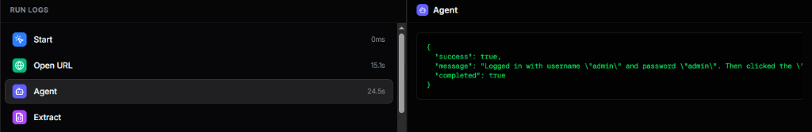
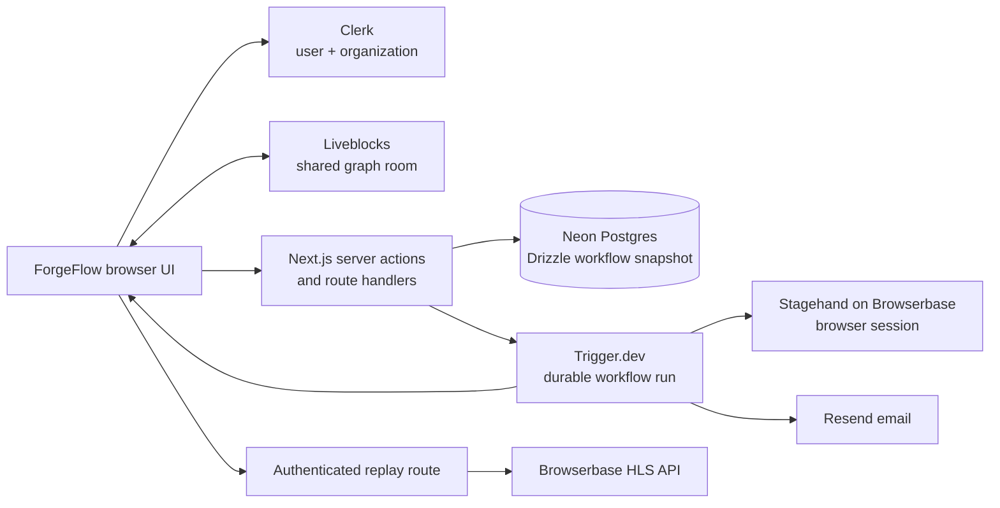
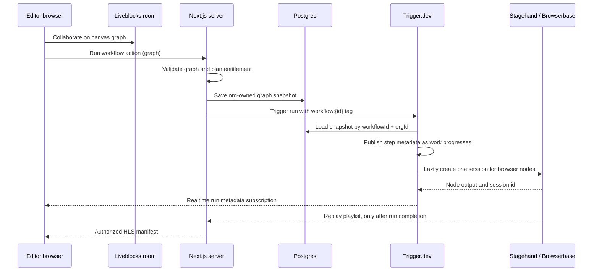
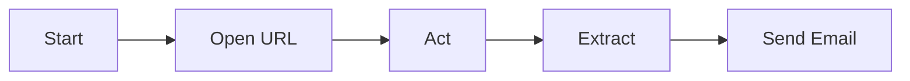

<div align="center">
  
  <h1>ForgeFlow</h1>
  <p><strong>A collaborative visual workflow builder for browser automation.</strong></p>

  <p>
    
    
    
    
    
    
    
    
  </p>
</div>

---

## Overview

ForgeFlow lets an organization compose browser-automation steps on a shared canvas, run the saved graph in a durable background task, inspect per-step results, and replay the browser session when available. The product keeps visual editing realtime while treating the database snapshot as the execution contract.

The workflow engine currently includes Start, Open URL, Act, Extract, Observe, Agent, and Send Email nodes. Values from upstream nodes can be interpolated into downstream fields with `{{ nodeId.path }}` references.

### Reference map

- [Architecture and state ownership](#architecture) — which system owns each kind of state.
- [Workflow engine](#workflow-engine) — graph rules, execution order, interpolation, node contract, and lifecycle.
- [Security and tenancy](#security-and-tenancy) — the authorization boundary for every external capability.
- [Local development and operations](#local-development) — environment, migrations, worker, checks, deployment, and incident triage.
- [Engineering conventions](#engineering-conventions) — how to make safe future changes.
- [/learnings](/learnings) — maintainers&apos; rationale, invariants, failure modes, and change playbooks.
- [PROJECT_MEMORY.md](PROJECT_MEMORY.md) — the handoff record for future engineers and AI agents.

## Features

| Area               | Included behavior                                                                                                                                |
| ------------------ | ------------------------------------------------------------------------------------------------------------------------------------------------ |
| Visual authoring   | React Flow canvas, node palette, connection-aware field tokens, graph validation, shared cursors, and organization-scoped rename/delete controls |
| Collaboration      | Liveblocks rooms scoped to the active Clerk organization                                                                                         |
| Durable execution  | Trigger.dev task runs ordered topologically with live metadata for each step                                                                     |
| Browser automation | Browserbase-hosted Stagehand session shared by all browser nodes in one run                                                                      |
| AI automation      | Configurable Stagehand Agent node, available to Pro organizations                                                                                |
| Outputs            | Step output, errors, durations, upstream interpolation, and serialized Observe results                                                           |
| Replay             | Authenticated, Pro-gated HLS playback through a server-side Browserbase proxy                                                                    |
| Email              | Resend delivery with per-run/per-node idempotency keys                                                                                           |
| Reliability        | Database ownership predicates, server-action authorization, cleanup in task `finally`, and Sentry integration                                    |

## Screenshots

| Workflow canvas                       | Runtime logs                            |
| ------------------------------------- | --------------------------------------- |
|  |  |

Additional implementation captures live in [`design/`](design/).

## Architecture



### State boundaries

| State                                | Owner                    | Why it lives there                                                                            |
| ------------------------------------ | ------------------------ | --------------------------------------------------------------------------------------------- |
| Canvas edits, cursors, room presence | Liveblocks               | Editors need low-latency collaborative updates.                                               |
| Runnable workflow graph              | Postgres JSONB           | The background task needs an organization-owned, server-readable snapshot.                    |
| Run status and step progress         | Trigger.dev run metadata | The UI can subscribe to queued/executing/completed work in realtime.                          |
| Browser session                      | Browserbase              | One lazily created session is reused across browser steps so the run has one coherent replay. |

### Runtime lifecycle



This split is deliberate. Liveblocks can change continuously while people edit; it is not the runner&apos;s source of truth. The runner never accepts a graph directly from a queued client request: it reloads the saved database snapshot using the workflow id and active organization id. Conversely, Trigger metadata is a live presentation channel, not durable run history.

### Domain model

The only application table is `workflows`:

| Column                     | Meaning                                             | Ownership rule                                                            |
| -------------------------- | --------------------------------------------------- | ------------------------------------------------------------------------- |
| `id`                       | UUID identifying a workflow and its Liveblocks room | Never trust it alone for an operation.                                    |
| `org_id`                   | Clerk organization id                               | Required in every workflow read, update, and delete predicate.            |
| `name`                     | User-visible name                                   | Trimmed, non-empty, and limited to 120 characters at creation and rename. |
| `graph`                    | JSONB `{ nodes, edges }` React Flow snapshot        | Validated before server-side persistence; this is the execution contract. |
| `created_at`, `updated_at` | Database timestamps                                 | Used for list ordering and audit context.                                 |

There is intentionally no ForgeFlow run-history table. Trigger.dev owns queued and completed run data, and its metadata drives the active console. If durable product-level run history is introduced, model it explicitly instead of attempting to reconstruct it from Liveblocks or a realtime subscription.

## Workflow engine

`features/workflows/nodes/node-registry.ts` is the source of truth for the editor and runner. A node declaration defines its kind, icon, editable fields, and outputs; `node-executors.ts` enforces that every action node has an executor.



At Run time ForgeFlow:

1. Validates that the graph has one Start node, connected nodes, and no cycle.
2. Saves the organization-owned graph snapshot.
3. Triggers `run-workflow` with a workflow-specific tag.
4. Topologically orders connected nodes and publishes pending/running/done/failed metadata.
5. Lazily opens one Browserbase session for browser nodes and always closes it.
6. Interpolates prior node output into later fields, for example `{{ open-url-1.title }}`.

### Graph validity and execution semantics

The validator has three structural rules: exactly one trigger (`Start`), at least one edge, and no cycle. The runner topologically sorts all graph nodes but executes only nodes attached to an edge. This means disconnected nodes are deliberately ignored, and the trigger itself is represented as a completed non-action step rather than dispatched to an executor.

The runner fails fast. A failed action marks that step failed, records its error and duration in metadata, then aborts later steps. It does not attempt rollback: browser interactions and sent email are external side effects. A `finally` block always closes a session that was opened, even on exceptions or cancellation.

Interpolation happens immediately before an executor runs. Node results are indexed by node id and paths are read with `{{ nodeId.path }}`. Missing paths become an empty string so a malformed template does not crash the task; it can still cause an external action to fail, which is why node output tokens should be selected from the registry rather than hand-typed.

### Node reference

| Node       | Kind    | Manifest fields         | Output paths                      | Runtime behavior                                                              |
| ---------- | ------- | ----------------------- | --------------------------------- | ----------------------------------------------------------------------------- |
| Start      | Trigger | None                    | None                              | The required graph entry point; no executor.                                  |
| Open URL   | Action  | `url`                   | `url`, `title`                    | Navigates the shared Stagehand page.                                          |
| Act        | Action  | `instruction`           | `success`, `message`, `url`       | Performs one atomic Stagehand action.                                         |
| Extract    | Action  | `instruction`           | `extraction`                      | Returns Stagehand extraction data.                                            |
| Observe    | Action  | `instruction`           | `matches`                         | Returns serializable selector/description matches, never raw browser objects. |
| Agent      | Action  | `instruction`           | `success`, `message`, `completed` | Runs the bounded Stagehand Agent; requires the organization Pro plan.         |
| Send Email | Action  | `to`, `subject`, `body` | `id`                              | Sends a text email through Resend with a run/node idempotency key.            |

The registry&apos;s `required` flag is editor metadata: it marks a field in the inspector, but the current server validator enforces only graph structure. Empty or malformed node values can therefore reach an executor and fail there. Field-level validation is intentionally listed as future work and must be added at both the client feedback and server execution boundaries.

### Adding or changing a node

Node behavior is registry-driven. Add an implementation in `features/workflows/nodes/`, register it in `node-executors.ts`, then add its manifest (kind, label, icon, fields, outputs, and accent) to `node-registry.ts`. The `satisfies` relationship in the executor map turns a missing action executor into a compile-time error. Do not add node-specific conditionals to the canvas or runner; those consume the registry.

When adding a field or output, decide whether it is safe to serialize into Trigger metadata and whether it needs to be interpolated downstream. Never put a Stagehand page, locator, error object with private data, secret, or oversized page payload in a node result.

## AI and browser capabilities

The Agent node uses Stagehand with `google/gemini-2.5-flash` and a bounded execution budget. The Open URL, Act, Extract, Observe, and Agent nodes share the same browser session within a run. Observe returns stable selector and description pairs so its output can be logged and reused safely.

Browser session replay is intentionally server-mediated: Browserbase playlist retrieval requires a secret key. ForgeFlow verifies the signed-in organization, the Pro plan, the owning workflow, the Trigger run tag, and the run&apos;s session id before returning an HLS manifest. The browser receives only the playlist and its short-lived signed segment URLs.

### Capability matrix

| Capability                                  | Browser visibility              | Server-side check                                                       | Primary owner         |
| ------------------------------------------- | ------------------------------- | ----------------------------------------------------------------------- | --------------------- |
| Create, list, edit, rename, delete workflow | Protected app only              | Active Clerk organization and `org_id` database predicate               | Next.js + Postgres    |
| Realtime canvas                             | Protected app only              | Liveblocks identity includes the current organization as its only group | Clerk + Liveblocks    |
| Run standard nodes                          | Visible to organization members | Server Action validates and saves the graph before Trigger dispatch     | Next.js + Trigger.dev |
| Run Agent node                              | Upgrade affordance in UI        | `has({ plan: "pro" })` is checked in the Server Action                  | Clerk Billing         |
| Cancel a run                                | Active run controls             | Workflow database ownership plus Trigger `workflow:{id}` tag            | Next.js + Trigger.dev |
| View replay                                 | Pro UI only                     | User, org, Pro plan, workflow ownership, run tag, and output session id | Next.js + Browserbase |
| Send email                                  | Workflow action                 | Resend response validation and `(runId, nodeId)` idempotency            | Trigger.dev + Resend  |

## Security and tenancy

Clerk organizations are ForgeFlow&apos;s tenancy boundary. The UI gate is only a usability cue; every sensitive action repeats its authorization on the server because Server Actions and route handlers are callable independently of the visible UI.

- Database queries for workflow mutation and retrieval include both `workflows.id` and `workflows.orgId`.
- Liveblocks user resolution filters users to the active organization, and issued room tokens carry that organization as the identity group.
- A Trigger task receives `workflowId` and `orgId`, then reloads the graph instead of trusting the initiating browser after queuing.
- Cancelling a run checks the owned workflow and its Trigger tag; a guessed run id is insufficient.
- The replay route verifies the full ownership chain before it uses the server-only Browserbase API key. A session id alone is never authorization.
- Browserbase, Liveblocks, Resend, Trigger.dev, Clerk secret, database, and Sentry auth credentials must never appear in client components, public environment variables, logs, workflow outputs, or emails.

The replay player treats HTTP `202` as “recording not ready” and polls. It treats authorization and other response errors as failures. HLS playback is intentionally served with `no-store` semantics because manifests contain short-lived signed media URLs.

### Route surface

| Route                                                   | Access                                        | Role                                                                                                   |
| ------------------------------------------------------- | --------------------------------------------- | ------------------------------------------------------------------------------------------------------ |
| `/`, `/workflows/[id]`, `/pricing`                      | Clerk-protected                               | Dashboard, workflow editor, and organization billing UI.                                               |
| `/sign-in`, `/sign-up`, `/choose-org`                   | Public/auth flow                              | Clerk&apos;s authentication and organization-selection surfaces.                                       |
| `/learnings`, `/test`                                   | Public                                        | Engineering notebook and visual design-system sandbox; neither is a workflow runtime surface.          |
| `POST /api/liveblocks/auth` and `/api/liveblocks/users` | Clerk-protected plus route-level org checks   | Issues scoped room identity and resolves only same-organization profiles.                              |
| `GET /api/replays/[sessionId]`                          | Clerk-protected plus Pro and ownership checks | Proxies an authorized Browserbase HLS playlist. It requires `workflowId` and `runId` query parameters. |
| `/api/sentry-example-api`, `/sentry-example-page`       | Clerk-protected                               | Intentional Sentry integration probes, not product features.                                           |

The Clerk proxy protects every route except the listed public routes. API handlers still validate the organization or capability they need; middleware authentication alone is not treated as tenancy authorization.

## Tech stack

| Category                   | Technology                                           |
| -------------------------- | ---------------------------------------------------- |
| Framework                  | Next.js 16 App Router, React 19, TypeScript          |
| UI                         | Tailwind CSS 4, shadcn/ui, Base UI, Lucide           |
| Canvas                     | `@xyflow/react` and `@liveblocks/react-flow`         |
| Realtime                   | Liveblocks rooms, presence, and user resolution      |
| Authentication and billing | Clerk users, organizations, and organization pricing |
| Database                   | Neon Postgres, Drizzle ORM, Drizzle Kit              |
| Background work            | Trigger.dev v4                                       |
| Browser automation         | Browserbase SDK and Stagehand v3                     |
| Email                      | Resend                                               |
| Observability              | Sentry and Browserbase session replay                |

## Observability, error handling, and operational safety

Sentry initializes on client, server, and edge runtimes. Browser telemetry enables tracing at a `1.0` sample rate, Session Replay at `0.1` normally and `1.0` on errors, and Sentry logs; server and edge tracing are also sampled at `1.0`. The Next.js integration routes browser telemetry through `/monitoring`, widens client source-map upload, and enables Vercel Cron monitor instrumentation when the deployment platform supports it. These defaults favor visibility over telemetry cost and should be deliberately re-tuned for production traffic.

The product has branded route-loading and local error boundaries; the global error boundary explicitly captures exceptions with Sentry. The Sentry example page and API deliberately throw errors for integration verification. They should not be presented as customer-facing functionality.

Two repository scripts need operational care:

- `check-db.ts` selects and prints every workflow row. Use it only against a controlled environment because graph contents may include URLs, prompts, and email recipients.
- `verify.js` reads `.env.local` and runs `DROP TABLE IF EXISTS users CASCADE`. Despite its name, it is destructive and is not part of the normal setup, validation, or deployment workflow.

## Installation

### Prerequisites

- Node.js 20 or later
- A Neon-compatible PostgreSQL database
- Clerk, Liveblocks, Trigger.dev, and Browserbase projects
- A Resend API key when using the Send Email node

```bash
git clone <your-fork-url>
cd Forgeflow
npm install
```

Create `.env.local` with the values below, then apply the database migration:

```bash
npm run db:migrate
```

### Environment variables

| Variable                            | Required                                        | Used for                                                 |
| ----------------------------------- | ----------------------------------------------- | -------------------------------------------------------- |
| `NEXT_PUBLIC_CLERK_PUBLISHABLE_KEY` | Yes                                             | Clerk client authentication                              |
| `CLERK_SECRET_KEY`                  | Yes                                             | Server-side Clerk authentication and organization checks |
| `DATABASE_URL`                      | Yes                                             | Application database connection                          |
| `DATABASE_URL_UNPOOLED`             | Recommended                                     | Direct connection for Drizzle migrations                 |
| `LIVEBLOCKS_SECRET_KEY`             | Yes                                             | Server-side room access tokens                           |
| `BROWSERBASE_API_KEY`               | Yes for browser nodes                           | Stagehand sessions and server-side replay retrieval      |
| `RESEND_API_KEY`                    | Yes for email nodes                             | Transactional email delivery                             |
| `TRIGGER_SECRET_KEY`                | Yes                                             | Trigger.dev task execution and management API            |
| `SENTRY_DSN`                        | Optional for a non-reporting environment        | Client, server, and edge telemetry initialization        |
| `SENTRY_AUTH_TOKEN`                 | Required only when uploading Sentry source maps | Authenticates the build-time Sentry plugin               |

Configure the organization-level `pro` plan in Clerk Billing to enable Agent and replay access.

## Local development

```bash
npm run dev
```

The development script starts Next.js and the Trigger.dev development worker together. It does not format source automatically; run the formatter intentionally before review. For one-off checks:

```bash
npm run format
npm run typecheck
npm run lint
npm run build
```

### Operational commands and release gate

| Command               | Purpose                                                               | Expected use                                                            |
| --------------------- | --------------------------------------------------------------------- | ----------------------------------------------------------------------- |
| `npm run dev`         | Starts Next.js and the Trigger.dev development worker                 | Daily local development.                                                |
| `npm run format`      | Runs Prettier on application TypeScript/TSX and root TypeScript files | Intentional source-formatting step; it is not part of `dev` or `build`. |
| `npm run typecheck`   | TypeScript without emitting files                                     | Before every review or commit.                                          |
| `npm run lint`        | ESLint for the application, excluding agent/template fixtures         | Before every review or commit.                                          |
| `npm run build`       | Runs the production Next.js build                                     | Release gate; catches server/client boundary issues.                    |
| `npm run db:generate` | Generates Drizzle migration files after schema changes                | Only when intentionally evolving the schema.                            |
| `npm run db:migrate`  | Applies migration files                                               | Controlled deployment step; run against the intended database only.     |
| `npm run db:studio`   | Opens Drizzle data inspector                                          | Local/debugging use; treat production data as sensitive.                |

Before a release, run the three static checks, migrate the intended database, deploy both Next.js and the Trigger worker, and exercise a real organization-scoped run. Include a Pro replay check and confirm that a different organization cannot retrieve its workflow, run, Liveblocks user data, or replay.

### Incident triage

| Symptom                        | Start here                                                                  | Likely boundary                                                            |
| ------------------------------ | --------------------------------------------------------------------------- | -------------------------------------------------------------------------- |
| Workflow never starts          | Server Action error and Trigger run creation                                | Graph validation, Clerk org, Trigger key, or worker deployment             |
| Step stays pending or running  | Trigger run metadata and worker logs                                        | Disconnected graph, worker mismatch, executor failure, or metadata publish |
| Browser step fails             | Trigger log plus Browserbase session                                        | Browserbase key, Stagehand instruction, page state, or external target     |
| Replay remains pending         | Replay route response and Browserbase recording status                      | Recording still processing; `202` should be retried                        |
| Replay is forbidden            | Clerk organization/plan, workflow ownership, Trigger tag, output session id | Security chain is correctly refusing access                                |
| Email is missing or duplicated | Trigger run id/node id and Resend result                                    | Sender configuration, Resend error response, or side-effect idempotency    |
| Canvas collaboration is absent | Liveblocks auth route and browser network requests                          | No active organization, Liveblocks secret, or room group mismatch          |

## Project structure

```text
app/                         App Router pages, layouts, and route handlers
app/api/liveblocks/          Organization-scoped Liveblocks auth and user lookup
app/api/replays/             Authenticated Browserbase HLS replay proxy
components/                  App shell and shared UI primitives
features/workflows/          Workflow data, server actions, canvas, nodes, and task
features/workflows/nodes/    Registry and executor for every node kind
features/workflows/tasks/    Trigger.dev workflow runner
lib/db/                      Drizzle schema, client, and migrations
lib/browserbase.ts           Server-only Browserbase observability client
proxy.ts                     Clerk route protection
trigger.config.ts            Trigger.dev worker configuration
```

## Engineering conventions

### Framework boundaries

- Use Server Components by default. Add `"use client"` only where browser state, event handlers, or a client-only library is required.
- Keep Clerk authorization, database access, Browserbase replay retrieval, Resend delivery, and Trigger management calls on the server. Client code receives UI-safe state only.
- Server Actions in `features/workflows/actions.ts` are mutation entry points. Route handlers are reserved for integrations that need an HTTP response, such as Liveblocks authentication and HLS replay.
- Derive row types from Drizzle&apos;s schema exports. Do not duplicate database shapes in consumers.

### Canvas and graph boundaries

- React Flow data must remain serializable because it travels through Liveblocks, JSONB, Trigger metadata, and browser props.
- Read the installed/current React Flow documentation before changing canvas APIs. The canvas is registry-driven; avoid hard-coded node type branches outside the registry/executor contract.
- Use `validateGraph` on both client preflight and server persistence. Client validation improves feedback; server validation is authoritative.
- A future explicit Save button must keep the same invariant: only a validated, organization-owned snapshot may execute.

### Background-task boundaries

- Trigger tasks must be deterministic about their input and must reload tenant-owned state inside the task. A task does not inherit a Clerk session.
- Publish concise, JSON-safe metadata. Treat it as a realtime view model, not an archive, secret store, or arbitrary object transport.
- Any external side effect must have an idempotency strategy that is scoped narrowly enough to permit intentional new runs. Send Email uses `runId` plus `nodeId` for this reason.
- Keep cleanup in `finally`, including when a task is cancelled. For Browserbase work, session lifetime is the run lifetime, not one node&apos;s lifetime.

### Documentation and dependency hygiene

- Update this README and `/learnings` whenever an ownership boundary, node contract, secret, or operational procedure changes. They are engineering references, not marketing copy.
- The working lockfile currently carries transitive audit advisories through upstream packages. Do not run `npm audit fix --force` casually: the reported forced resolutions can downgrade or break the current Next.js, Trigger.dev, or Drizzle Kit stack. Reassess with compatible upstream releases and verify the full build after any dependency change.
- The repository has no automated test suite yet. Typecheck, lint, production build, real organization-scoped workflow execution, and replay authorization are the current minimum validation set. Add focused tests alongside future changes to graph validation, authorization, node executors, and runner behavior.

## Project highlights

- A single registry drives canvas node creation, inspector fields, output tokens, and action-executor completeness.
- Workflow persistence is organization-scoped at every database mutation and lookup.
- The runner publishes metadata before, during, and after each step so the canvas reflects active work.
- Browserbase replays are kept behind an authenticated server proxy and are tied back to a workflow run.
- Retryable email work is idempotent within a Trigger run, preventing duplicate delivery after a later-step failure.

## Deployment

1. Provision a PostgreSQL database and set `DATABASE_URL`.
2. Configure Clerk organizations and the `pro` plan, then add the production redirect URLs.
3. Add Liveblocks, Browserbase, Trigger.dev, Resend, and optional Sentry secrets to the deployment environment.
4. Run `npm run db:migrate` as part of the release process.
5. Deploy the Next.js app and deploy or connect the Trigger.dev worker for the same environment.
6. Verify a Pro organization can complete a browser run and view its replay without exposing `BROWSERBASE_API_KEY` in the browser.

## Scale and present constraints

ForgeFlow favors clear ownership over premature caching. Liveblocks is throttled to 16 ms for collaborative canvas updates, Trigger metadata is intentionally compact, and one Browserbase session is shared across browser nodes in a run to preserve page state and avoid unnecessary sessions. The canvas is constrained to a 16 px grid and `maxZoom` 1.3; dark mode is currently forced even though the CSS token system defines both light and dark values.

The following limits are current implementation facts, not guarantees hidden behind the UI:

- The database migration defines only the workflow primary key. As workflow volume grows, evaluate an index aligned with `org_id` plus the list ordering (`created_at`) before list queries become a bottleneck.
- Workflow persistence happens when Run saves the canvas. There is no explicit Save command and no durable ForgeFlow run-history table.
- Replay retrieval selects the first Browserbase page in a recording. Multi-page sessions are not yet selectable in the player.
- Workflow deletion removes the database row first and then attempts Liveblocks room deletion. The room cleanup is best-effort; a Liveblocks failure is logged and does not restore the workflow.
- Clerk Billing defines more plan features than the application currently enforces. In code, the `pro` plan gates the Agent node and replay; there is no implemented priority queue or workflow-count enforcement.
- The app has no explicit application-level rate limiting and no automated test suite. Authorization, graph validation, external-service failures, and replay access should be exercised as part of release verification.

## License

No license file is currently included. Treat the repository as proprietary until a license is added.
